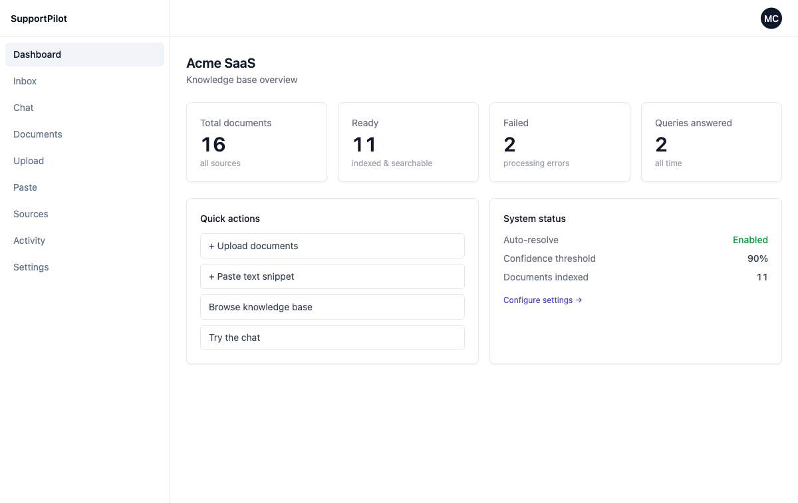
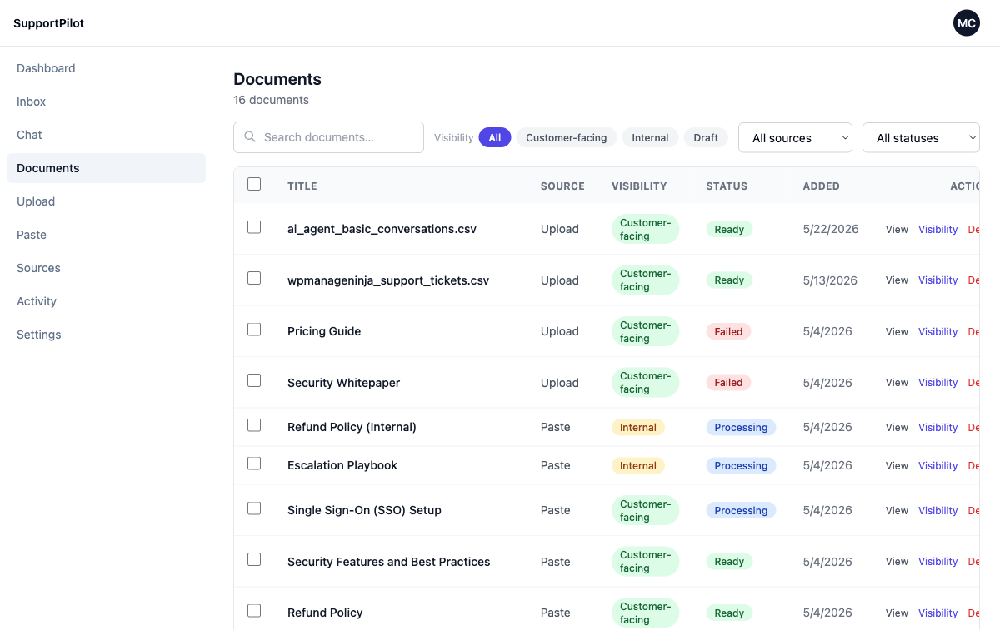
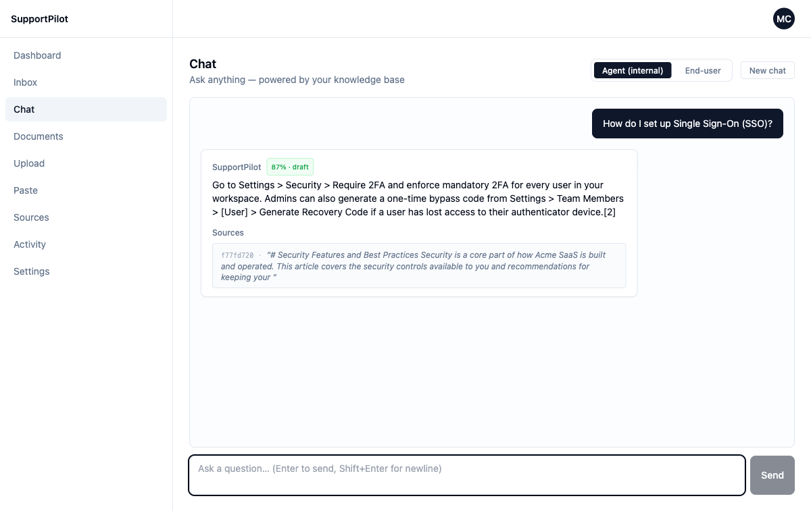
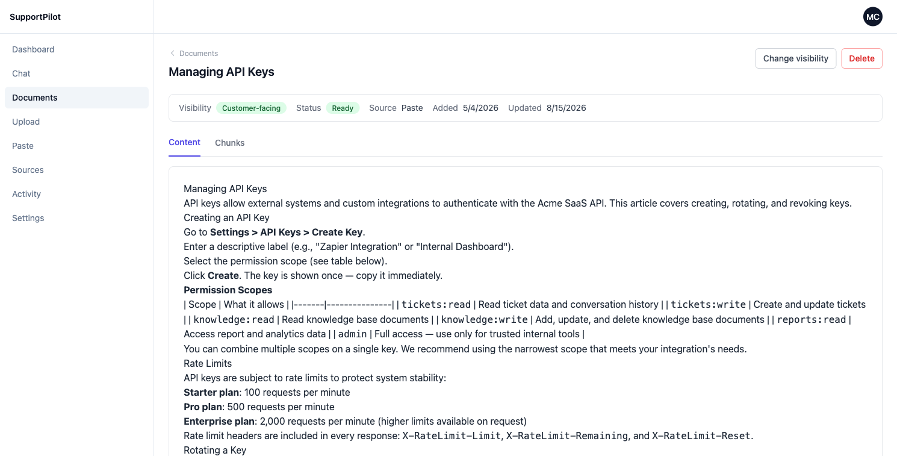
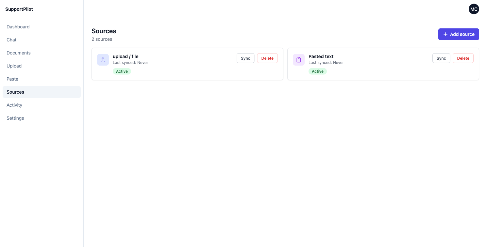
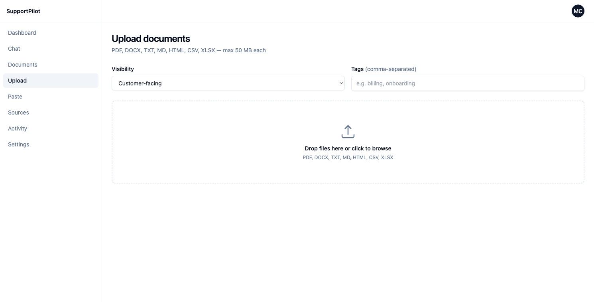
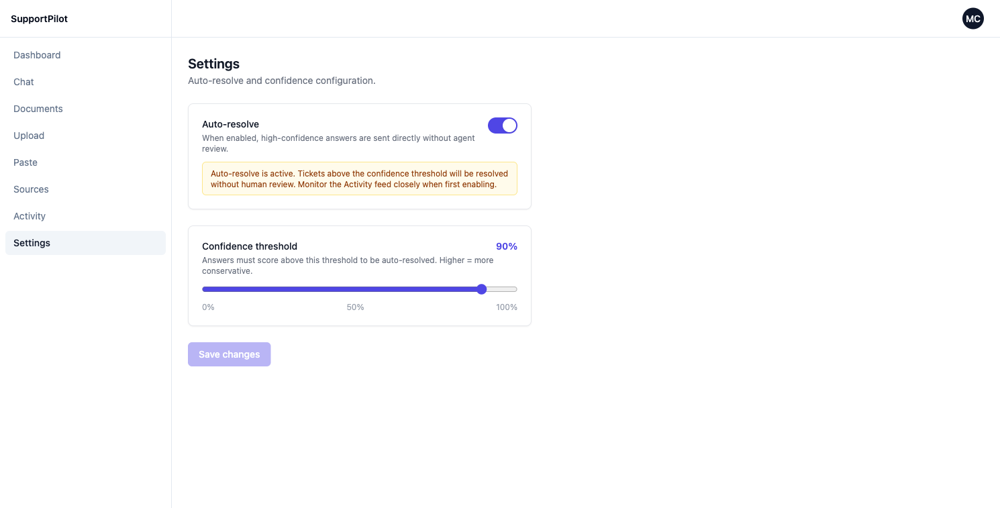

# SupportPilot

**A RAG-powered customer support automation platform for mid-market SaaS companies.**

SupportPilot ingests a company's docs, past tickets, and Slack threads, then either drafts answers for human agents inside Zendesk/Intercom or resolves Tier-1 tickets automatically — every answer backed by a visible, clickable citation back to the source document.

[](package.json)
[](tsconfig.json)
[](web)
[](#tech-stack)
[](#license)

---

## Why this project exists

Mid-market SaaS support teams drown in repetitive tickets — roughly 70% of incoming questions are already answered somewhere in the company's own docs, tickets, or Slack history. Off-the-shelf chatbots hallucinate; generic RAG demos don't handle multi-tenancy, visibility rules, or auditability. SupportPilot is a from-scratch implementation of what a *production-grade* support RAG system actually needs:

- **Traceable answers** — every response cites the exact chunk it came from. No black-box replies.
- **Multi-tenant by design** — every document, vector, and query is scoped by `tenantId`, enforced at the data layer, not just in application code.
- **Visibility-aware retrieval** — customer-facing chat only ever sees `customer-facing` docs; internal agent tools can also see `internal` docs. Enforced server-side, not in the UI.
- **Hybrid retrieval** — dense vector search (Qdrant) + keyword search (Meilisearch), fused with Reciprocal Rank Fusion, then reranked with a cross-encoder before generation.
- **Free & self-hostable end-to-end** — no paid SaaS dependency required to run the full stack locally.

---

## Screenshots

| Knowledge dashboard | Document management |
|---|---|
|  |  |

**Live RAG answer with citation, confidence score, and route (auto-resolve vs. draft-for-agent):**



**Document detail — full extracted content, visibility, and processing status per source:**



| Connected sources | Drag-and-drop upload | Auto-resolve safety controls |
|---|---|---|
|  |  |  |

---

## How it works

```
 Browser (admin)              Channels (Zendesk · Slack · Chat widget · Email)
       │                                        │  webhooks / API
       ▼                                        ▼
┌─────────────────────────────────────────────────────────┐
│                 Express API (auth + tenant routing)      │
└───────────────────────┬───────────────────────────────────┘
                         │
          ┌──────────────┴──────────────┐
          ▼                             ▼
 ┌─────────────────┐          ┌─────────────────────────┐
 │  Ingestion jobs  │          │  RAG pipeline            │
 │  parse → chunk   │          │  1. Rewrite query         │
 │  → embed → index │          │  2. Hybrid retrieve (RRF) │
 └────────┬─────────┘          │  3. Rerank (cross-encoder)│
          │                    │  4. Generate + cite        │
          ▼                    │  5. Confidence → route     │
 ┌─────────────────┐          └───────────┬────────────────┘
 │ Qdrant (vectors) │◄──────────────────────┤
 │ Meilisearch (BM25)│◄─────────────────────┤
 │ Ollama / Groq LLM │◄─────────────────────┘
 └─────────────────┘
          ▲
          │
 ┌─────────────────────────────────────────────┐
 │ MongoDB — tenants, documents, chunks, tickets,│
 │ drafts, feedback, audit logs (source of truth)│
 └─────────────────────────────────────────────┘
```

Every claim in a generated answer must cite at least one retrieved chunk — uncited claims are rejected and regenerated or escalated to a human rather than left to bluff.

---

## Tech stack

| Layer | Choice |
|---|---|
| Runtime | Node.js 20, Express, TypeScript (strict) |
| Frontend | React + Vite, TanStack Query, Tailwind CSS |
| Database | MongoDB (single source of truth, native install) |
| Vector search | Qdrant |
| Keyword search | Meilisearch |
| Embeddings / reranker | `@xenova/transformers` (ONNX, runs locally — `bge-small-en-v1.5` + `bge-reranker-base`) |
| LLM | Ollama (local `llama3.1:8b`) or Groq / Gemini (hosted free tiers) behind one swappable `LLMClient` interface |
| Jobs | Agenda (MongoDB-backed scheduling/retries) |
| Validation | Zod end-to-end — every external input parsed before use |
| Observability | Pino structured logs, Langfuse tracing |
| Testing | Vitest + `mongodb-memory-server` |

No Docker, no Redis, no Postgres — every component is a native install, which keeps the whole stack runnable on a laptop with zero paid infrastructure.

---

## Key features

- **Knowledge dashboard** — connect Zendesk/Notion/Slack/Confluence/GitHub, drag-and-drop upload PDFs/DOCX/CSV, or paste text snippets directly.
- **Visibility control** — mark any document `customer-facing`, `internal`, or `draft`, enforced at the retriever, not just the UI.
- **Agent copilot** — drafts replies with citations for a human to approve/edit.
- **Auto-resolver** — high-confidence tickets are resolved without a human, with a per-tenant confidence threshold and instant human-handoff escape hatch.
- **Activity feed** — every question, answer, citation, and confidence score is logged and searchable.
- **"Forget" flow** — a full purge path (vectors + search index + cache + audit log) for GDPR-style data removal.
- **Eval harness** — a golden Q&A set scored with Ragas-style metrics (faithfulness, relevance, context precision) so retrieval quality is measured, not assumed.

---

## Quickstart

### Prerequisites

```bash
brew install node@20 mongodb-community
brew services start mongodb-community

# Ollama — https://ollama.com (native installer)
ollama pull llama3.1:8b

# Qdrant binary — https://github.com/qdrant/qdrant/releases (place in project root)
# Meilisearch binary
curl -L https://install.meilisearch.com | sh
```

### Setup

```bash
git clone https://github.com/niteshdass/rag-support-sytem.git
cd rag-support-sytem
cp .env.example .env      # fill in MONGODB_URI + LLM provider keys
nvm use                   # node 20
npm install
cd web && npm install && cd ..
```

### Run

```bash
npm run dev       # API on :3000
npm run dev:web   # admin dashboard on :5173 (separate terminal)
./qdrant &         # vector store on :6333
./meilisearch &    # keyword search on :7700
```

> A single `pm2 start ecosystem.config.cjs` runs all of the above together if you have PM2 installed.

### Seed demo data & log in

```bash
npm run seed              # idempotent — safe to re-run
npm run seed:reset        # wipe + re-seed
```

```
http://localhost:5173
Tenant:   acme-saas
Email:    admin@acme-saas.com
Password: demo1234
```

The seeder creates 3 demo tenants, sample docs (PDFs, help articles, internal playbooks), historical tickets, and Slack threads — enough to exercise retrieval, visibility rules, and multi-tenant isolation out of the box.

---

## Useful commands

```bash
npm test           # run test suite (Vitest)
npm run eval        # run the RAG eval harness against the golden set
npm run lint         # eslint
npm run seed:tenant  # seed a single tenant

pm2 status / logs / restart all / stop all   # if using PM2
```

---

## Project structure

```
src/
├── api/           REST routes, middleware (auth, tenant scoping, rate limiting)
├── domain/        Pure business logic — RAG pipeline, ingestion, knowledge mgmt
│   └── rag/       queryRewriter → retriever → reranker → generator → confidence
├── infra/         External clients — Mongo, Qdrant, Meilisearch, LLM, storage
├── jobs/          Agenda job definitions (ingest, re-embed, purge)
└── observability/ Logging, tracing, metrics

web/               React + Vite admin dashboard
widget/            Embeddable chat widget
scripts/seed/      Deterministic demo-data seeder
scripts/eval/      RAG quality eval harness
```

Design principles behind this layout — pure domain logic with no I/O, Zod validation at every boundary, `tenantId` enforced at the data layer — are documented in [`CLAUDE.md`](CLAUDE.md).

---

## Multi-tenancy & security model

- Every MongoDB query, Qdrant filter, and Meilisearch index is scoped by `tenantId`.
- Meilisearch uses **one index per tenant** rather than filtering a shared index, eliminating an entire class of cross-tenant leak.
- Customer-facing channels (chat widget, email, auto-resolve) can only retrieve `customer-facing` documents; internal tools can also see `internal` documents. `draft` documents are never retrievable until promoted.
- Every cross-tenant action by support staff is written to an append-only audit log.
- Optional PII redaction sidecar (Presidio) can scrub queries before they reach the LLM.

---

## License

MIT
